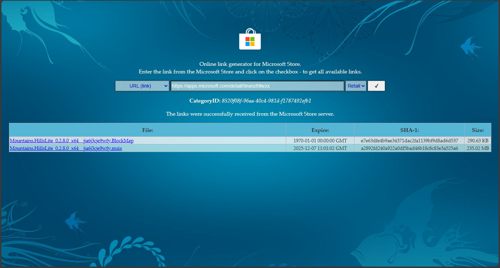
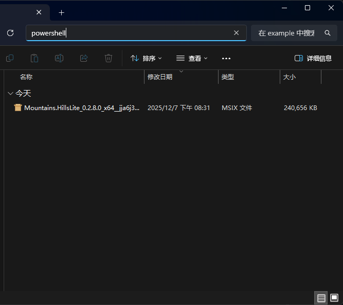

# 离线安装 Hills Lite

精简版 Windows（或专业工作站版）没有 Microsoft Store，不能直接安装 Hills Lite。

因此需要手动下载安装包并使用 Powershell 安装。

## Step 1 下载安装包

打开 [下载器](https://store.rg-adguard.net/)



如图，选择 `URL(link)` 模式、填入商店地址、选择 `Retail` 版本，并点击 `√`

::: tip 提示
在这里，商店地址是
```url
https://apps.microsoft.com/detail/9nxnzfrllwzx
```
:::

接着点击以 `.msix` 为后缀的文件下载，在此处是第二个链接

## Step 2 安装

打开下载的 `.msix` 文件的文件夹，在资源管理器路径栏输入 `powershell` 并回车



在 Powershell 中，运行以下命令：
```ps1
Add-AppxPackage -Path .\Mountains.HillsLite_0.2.8.0_x64__jja6j3cje9wfy.Msix
```