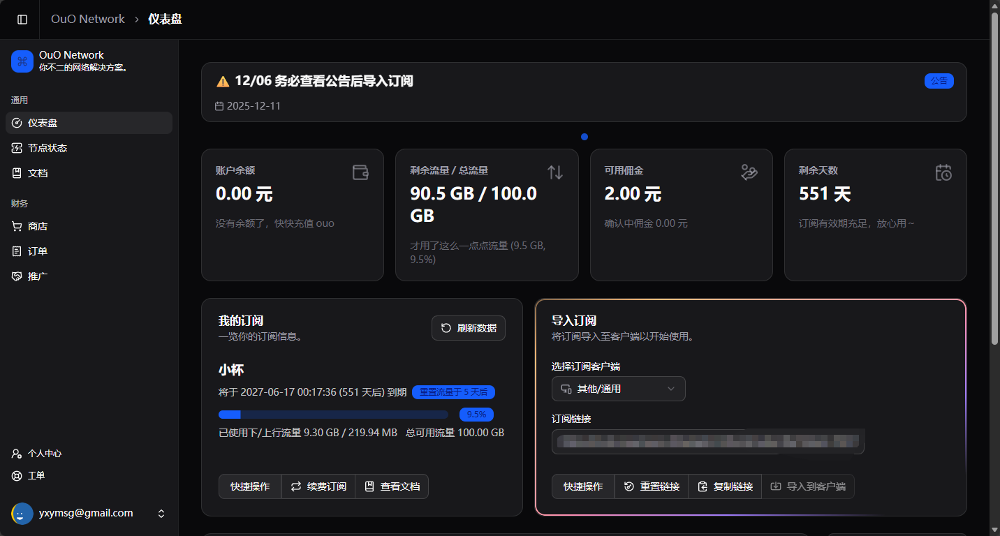

# 代理

## 获取订阅信息

大部分代理公司，或者说“机场”，获取订阅的过程都是差不多的。在服务被屏蔽的地区，我们可能需要依靠代理来绕过屏蔽，使用服务。

之前，我们注册并购买了“OuO Network”的服务，此时到用上它的时候了！

登录[官网](https://dash.ouonetwork.com/register?i=uKb9Y56n)，在首页点击“复制链接”按钮

**注意目前为止订阅链接有效期仅有5分钟，软件导入后记得修改自动更新为停用或间隔为0**

保存好，不要泄露自己的订阅链接！（包括微信QQ抖音私发、群发、公开发布，会有自动检测）

## 下载客户端

- [Windows/Linux/MacOS](https://github.com/mihomo-party-org/clash-party/releases/latest)
- [Android](https://github.com/getsurfboard/surfboard/releases/latest)
- [iOS](https://apps.apple.com/us/app/shadowrocket/id932747118)（需美区Apple ID）
- [OpenWrt](https://github.com/vernesong/OpenClash/releases) （不推荐新手使用）

