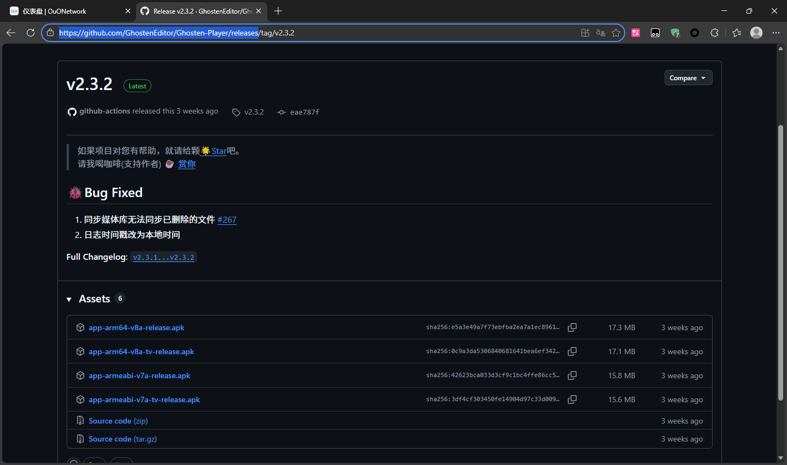
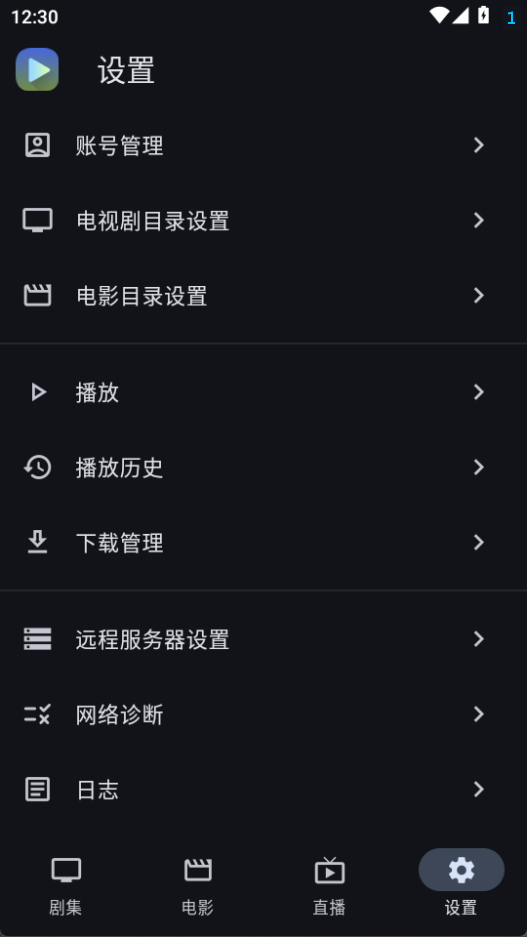
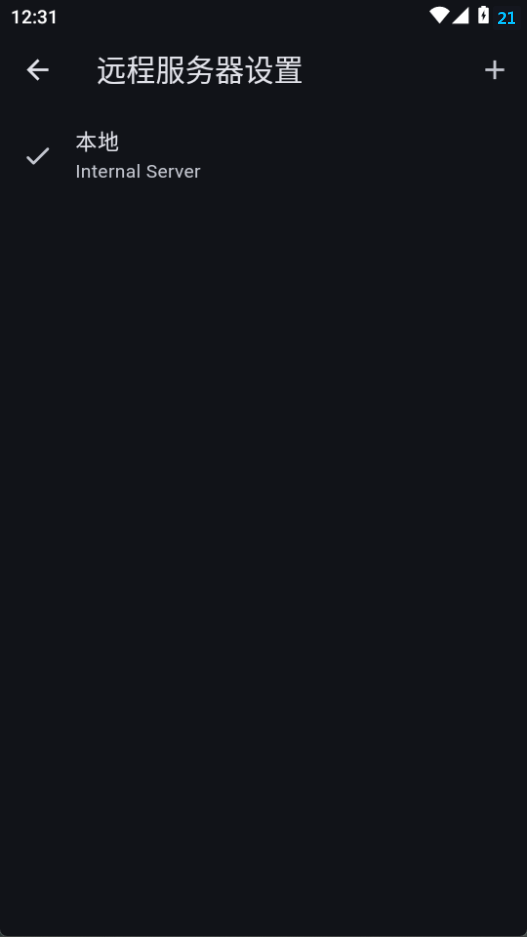
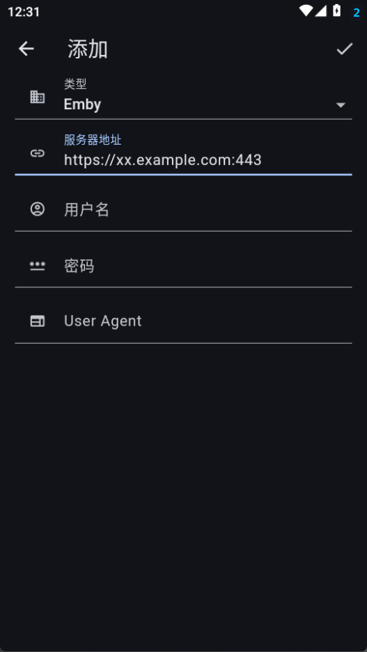
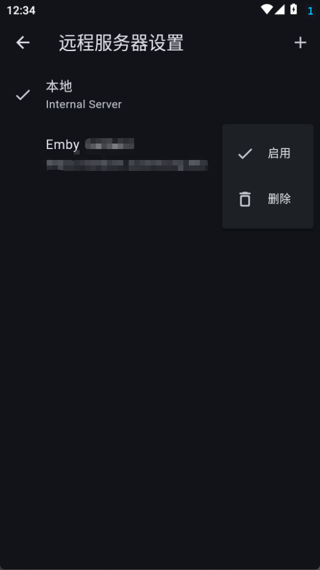
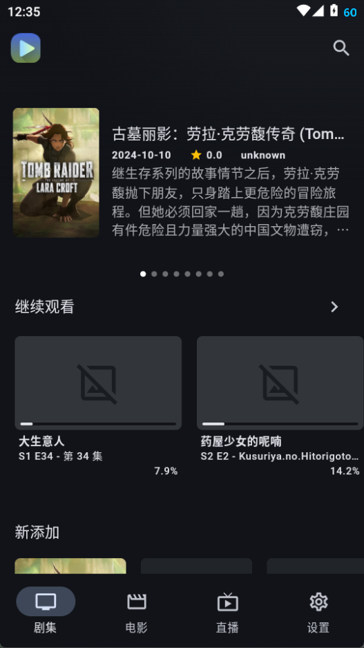

# Android 使用

本教程以 Ghosten Player 为例，[下载链接](https://github.com/GhostenEditor/Ghosten-Player/releases/latest)

大部分情况下下载第一个文件就足够了，如果你的手机比较老可以尝试下载第三个。安装就不用多说了吧直接打开安装包就行，注意不要被系统自带浏览器和什么应用市场什么的坑了。

打开 Ghosten Player，底栏设置->远程服务器设置

右上角加号

注意这里直接写原本用冒号连着的地址就行不用分开，User Agent不用填，然后右上角对钩。

回到这个页面，选择新出现的服务器，点启用

然后左上角一路返回到首页就可以看了，我这里没有开代理所以没有加载出来

## 继续

- [返回](README.md)
