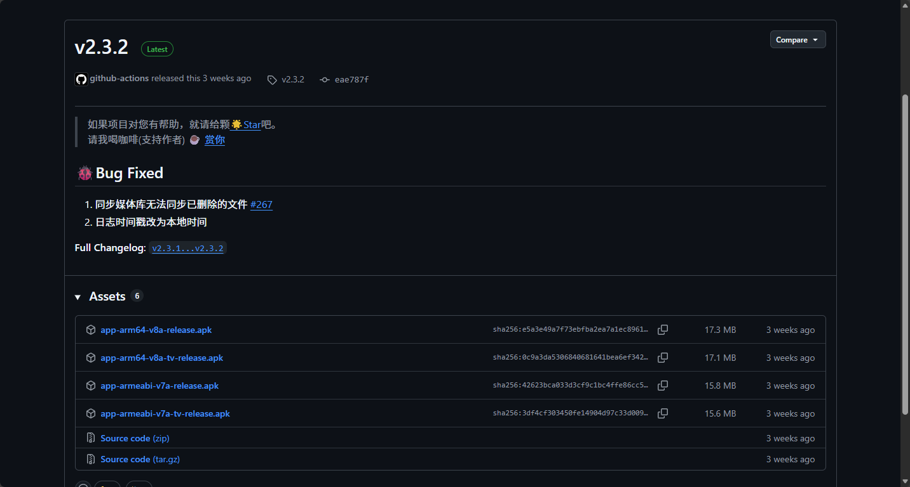
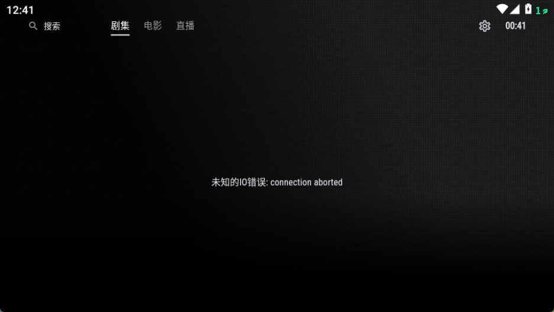
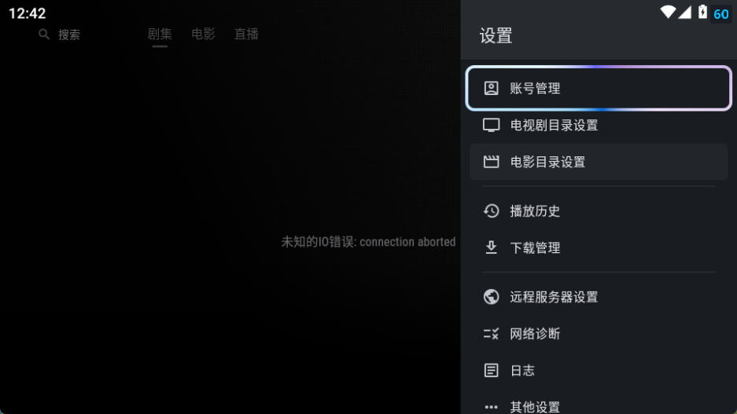
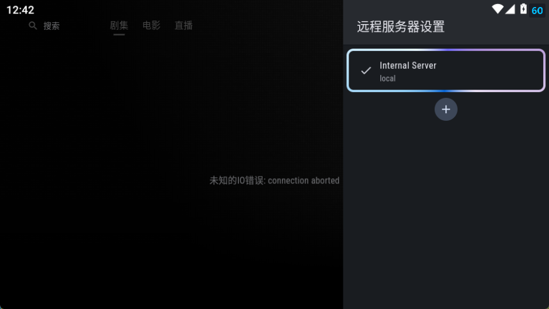
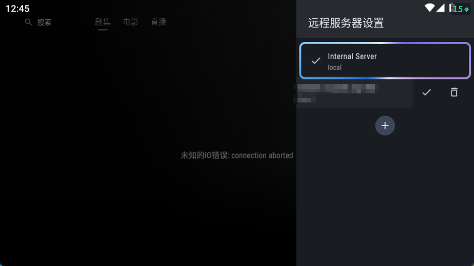
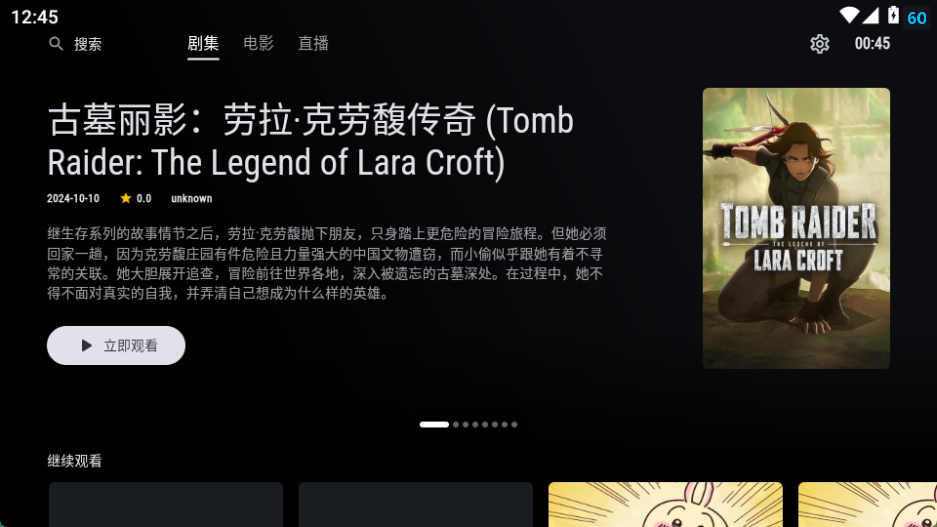

# Android TV 使用

此处以 Ghosten Player 为例，[下载链接](https://github.com/GhostenEditor/Ghosten-Player/releases/)

一般选第二个即可，老设备选第四个，安装自行查询自己电视型号。

进入右上角齿轮

进入远程服务器设置

加号

输入完整链接、用户名、密码，User Agent留空，点确认。

回到这个界面，点击新出现的服务器，点√。

回到主页，切换一下标签页再切回来，就可以使用了。

## 继续

- [返回](README.md)