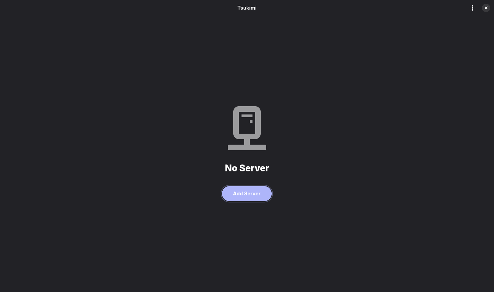
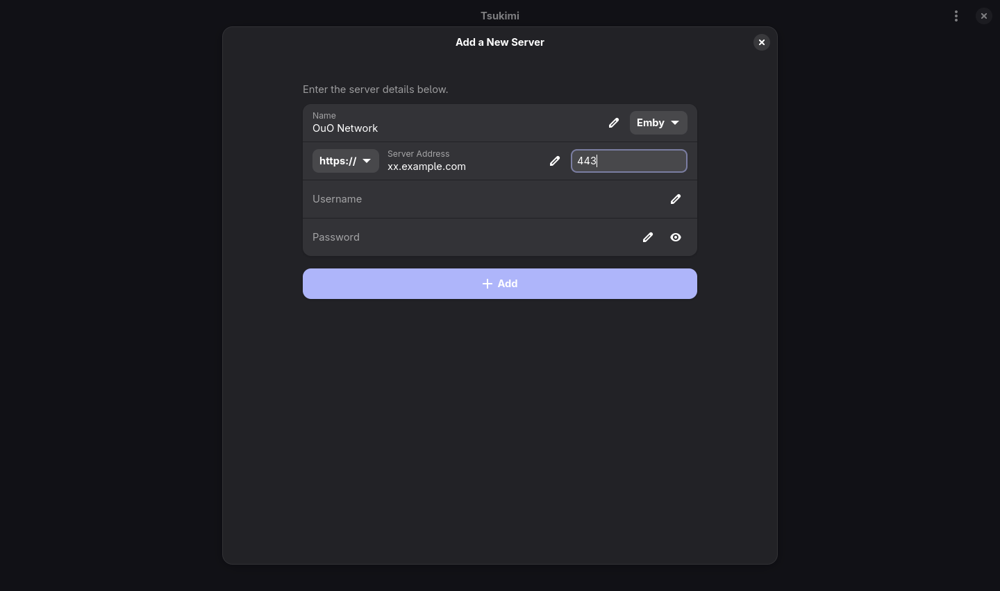
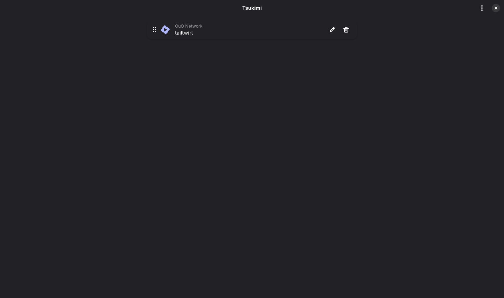

## Linux 使用

以 Tsukimi 为例。

## 安装

此处仅以debian系为示范。

首先安装flatpak，在终端（`bash`）中运行：

```sh
sudo apt install flatpak -y
sudo flatpak remote-add --if-not-exists flathub https://dl.flathub.org/repo/flathub.flatpakrepo
```

然后使用flatpak安装tsukimi：

```sh
sudo flatpak install flathub moe.tsuna.tsukimi
```

然后重启电脑

## 使用

```sh
flatpak run moe.tsuna.tsukimi
```



点击 Add Server



填写名称、选择https协议、填写域名和端口、用户名（Username）、密码（Password），点击 Add



回到这个界面，点击新添加的服务器


可以使用（我使用的WSL安装的所以中文乱码，理论上正常Linux无此问题）

## 继续

- [返回](README.md)

