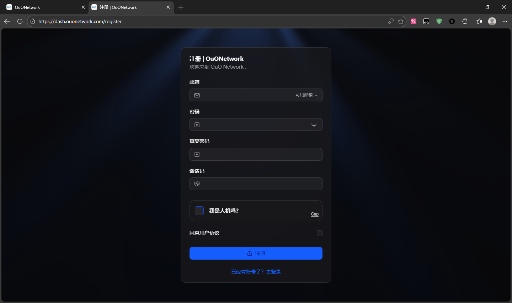
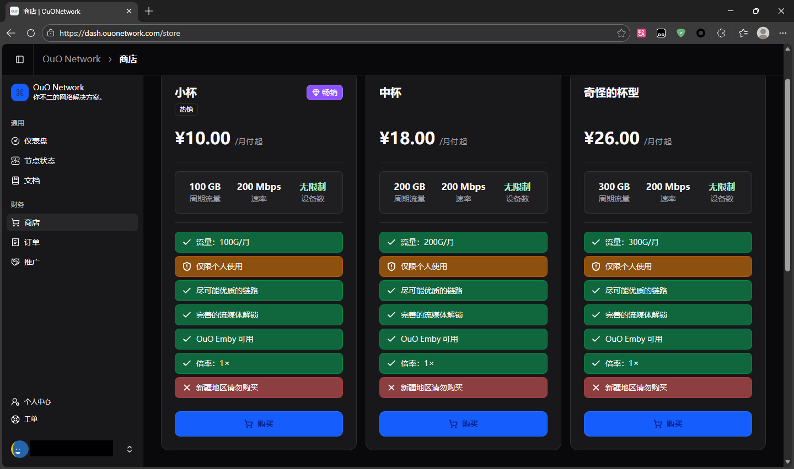
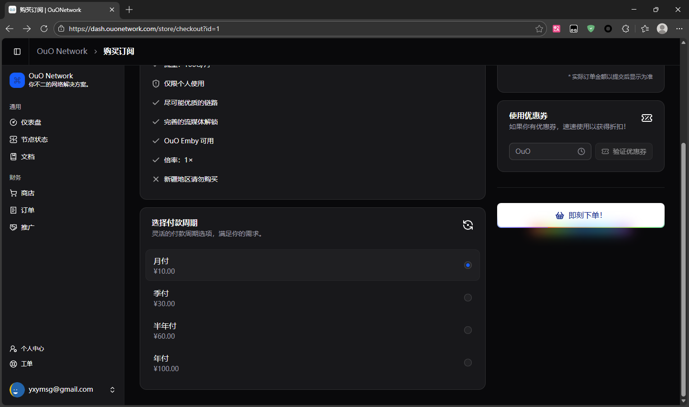
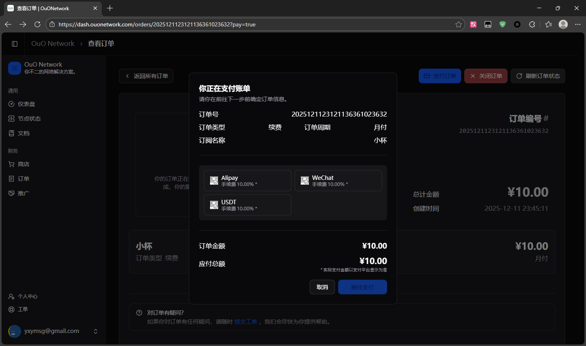
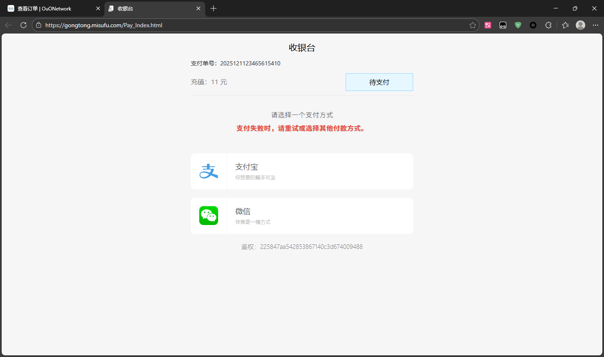
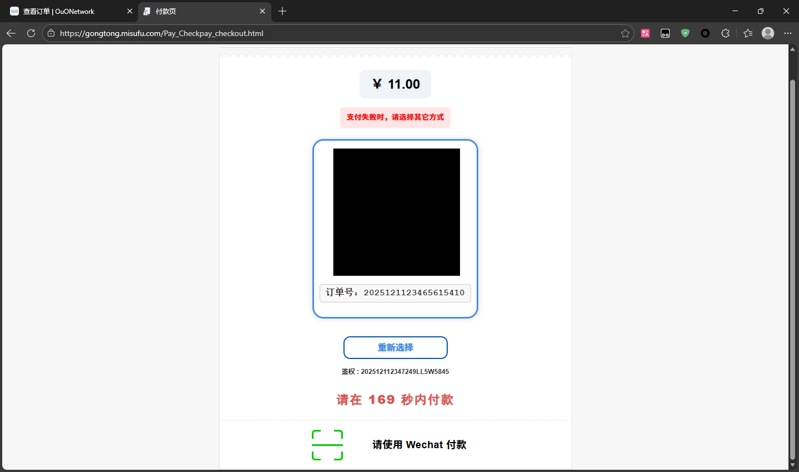
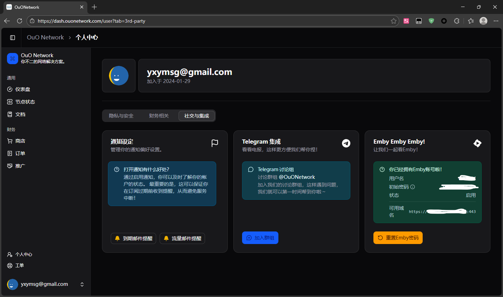

# 获取 OuO Network Emby 服务器

首先，需要[注册该机场的账户](https://dash.ouonetwork.com/register?i=uKb9Y56n)，并购买套餐（想白嫖找公益服）

*点击左侧菜单栏商店->选择套餐购买*

*选择付款周期->即刻下单*

*选择付款方式->前往支付*

*三方收银台页面->选择支付方式*

*扫码付款/手机版跳转微信付款*

*付款后返回浏览器自动跳转（未跳转直接前往官网查看，未到账联系TG客服）*

购买好订阅后，左侧栏->个人中心->社交与集成->Emby 注册账号，若报错尝试刷新页面查看上面的凭据是否显示

您现在就获得了账号、密码、服务器地址。

::: tip 提示

如果您遵照我们的教程获得，应该是一串类似于`https://xx.example.com:443`的链接，您应该把它拆分成两部分：主机名（`https://xx.example.com`）、端口（`443`）。

:::

## 继续

- [返回](README.md)