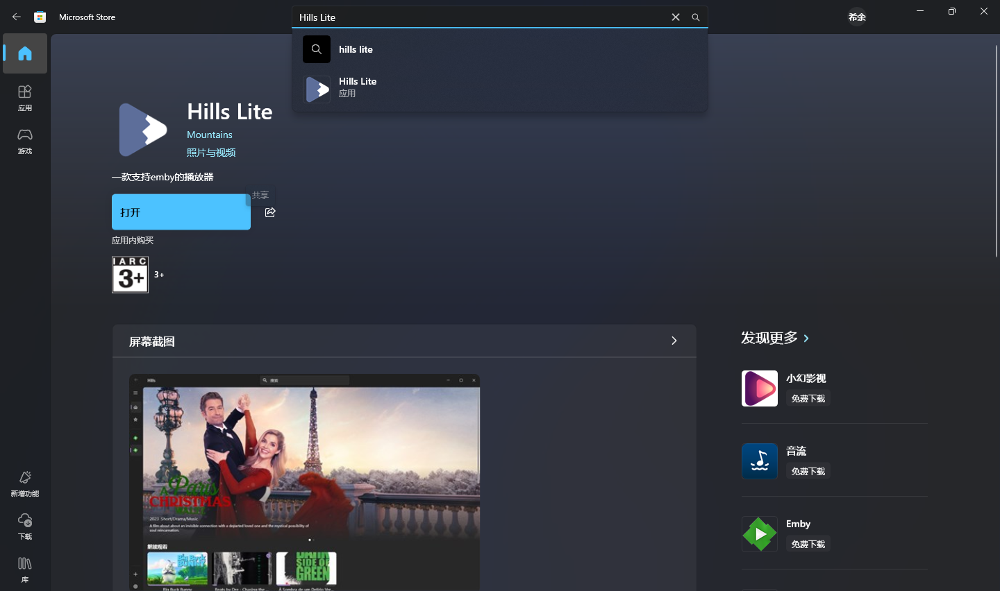
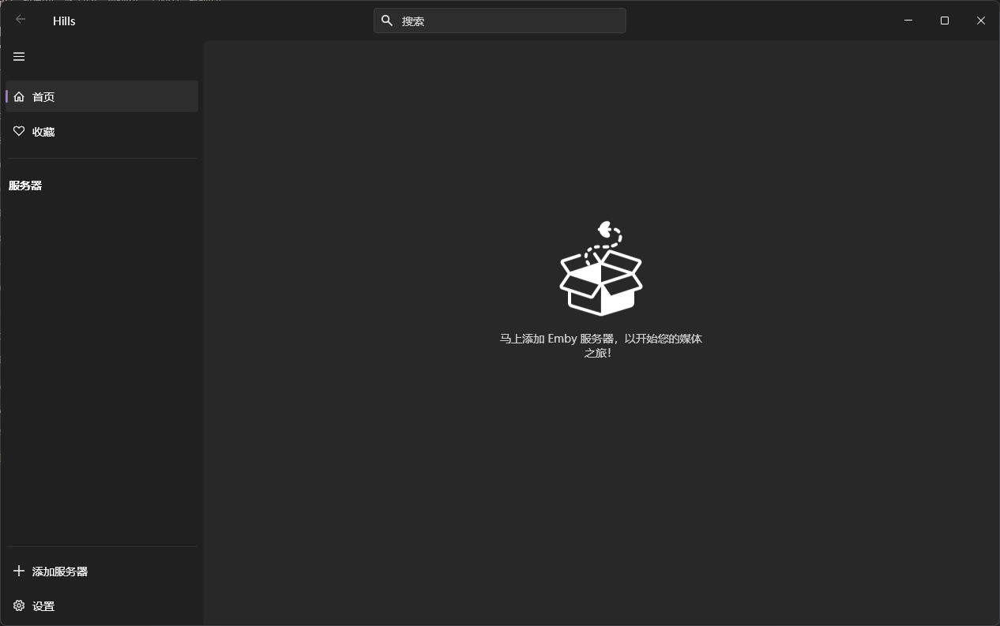

# Windows 使用

以 Hills Lite 为例。

## 安装

**在此前教程中已安装过 Hills Lite 的用户，跳过此步骤。**

*本步骤需要您的 Windows 系统带有可以正常使用的 Microsoft Store，否则请参考[此处](../install/offline-appx.md)*

在开始菜单中，找到Microsoft Store，打开，在顶部搜索栏搜索 `Hills Lite`

进入该页面后，点击安装即可。

## 使用

从开始菜单中打开 Hills Lite，界面如下

点击左下角的“添加服务器”选项，根据之前获取的信息填写，点击登录

在侧边栏选择对应服务器，即可享受

## 继续

- [返回](README.md)
